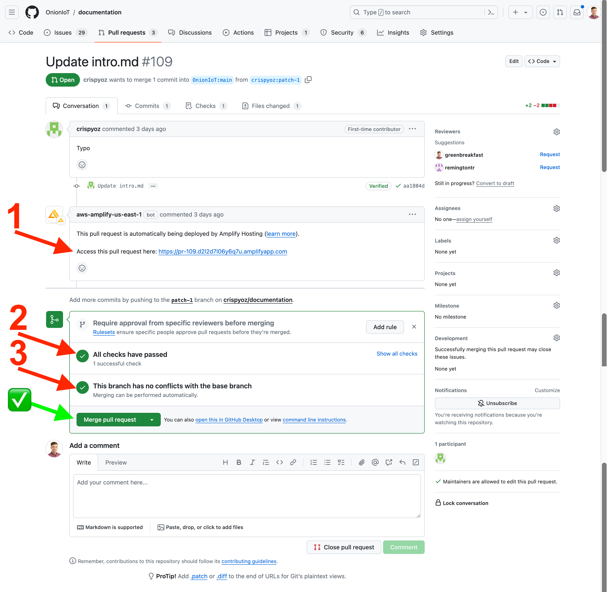
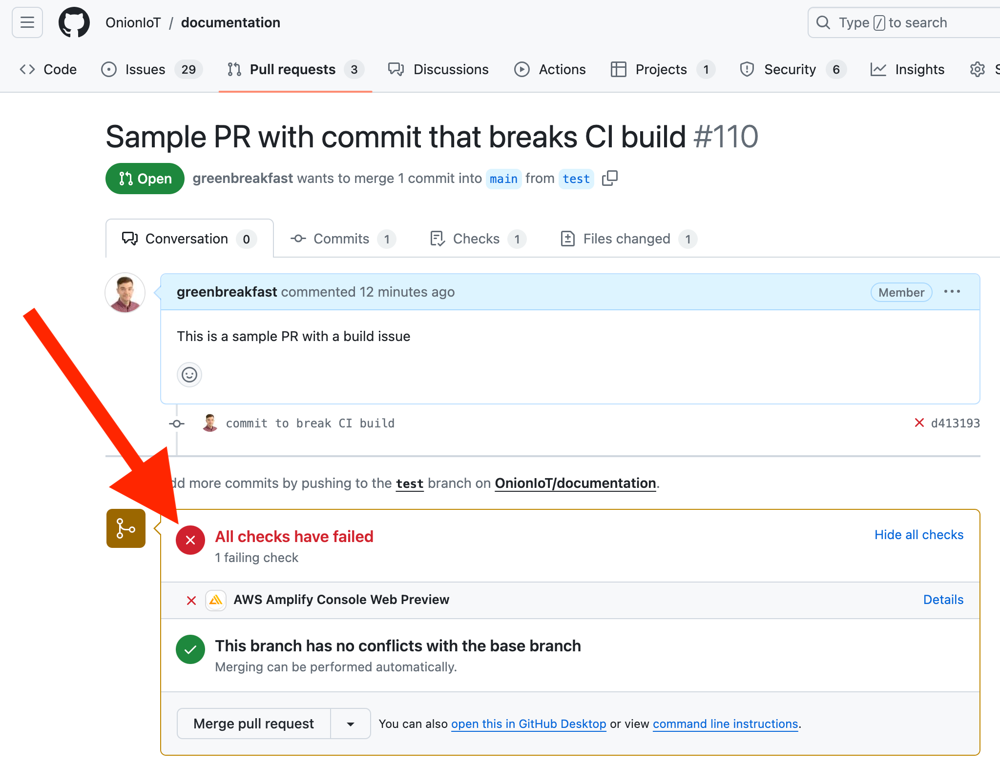

# Guide to Merging Pull Requests

This document outlines the process for merging a PR and explains common pitfalls

## Merging a PR

A PR that is safe to be merged looks like this: 

The key items to look out for:
1. The AWS Amplify CI (Continuous Integration) system has successfully built the documentation site using the content in the PR branch and is temporarily hosting a test URL
2. All checks have passed (meaning AWS Amplify CI was successful in building the documentation site)
3. No merge conflicts

**Only a PR that meets all of the above is safe to be merged** into the `main` branch and will not break the documentation site.

It is recommended to review the content by looking at **Files Changed** and checking the test deployment at the URL in Item #1 above.

### How to Merge

If all 3 key items are ok and the content is good, click the **Merge Pull Request** button (indicated by the ✅ in the screenshot above).

This will push a commit to the `main` branch and will trigger the CI system to build and deploy to https://documentation.onioniot.com/

## Common Pitfalls

Overivew of the common issues that can present in a PR and indicate it **should not be merged until the issues are resolved**.

### CI Preview Build Fails

When the updates in the PR branch cannot be successfully compiled by the CI system, the PR will look something like this:

The issue causing the build failure must be resolved before the PR can be merged. See the [CI Build section in the README](README.md#ci-build) for information on how the CI system builds the documentation site.

Fixes can be pushed to the base branch involved in the PR, and the CI will try to build again. The PR is safe to merge when the PR shows the check is passing (see the [Merging a PR section](#merging-a-pr) above).

### Merge Conflicts

Merge conflicts are caused by competing line changes in the base branch and the target branch of the PR. See [the guide on resolving a merge conflict on GitHub](https://docs.github.com/en/pull-requests/collaborating-with-pull-requests/addressing-merge-conflicts/resolving-a-merge-conflict-on-github) for more information on how to resolve this issue.
