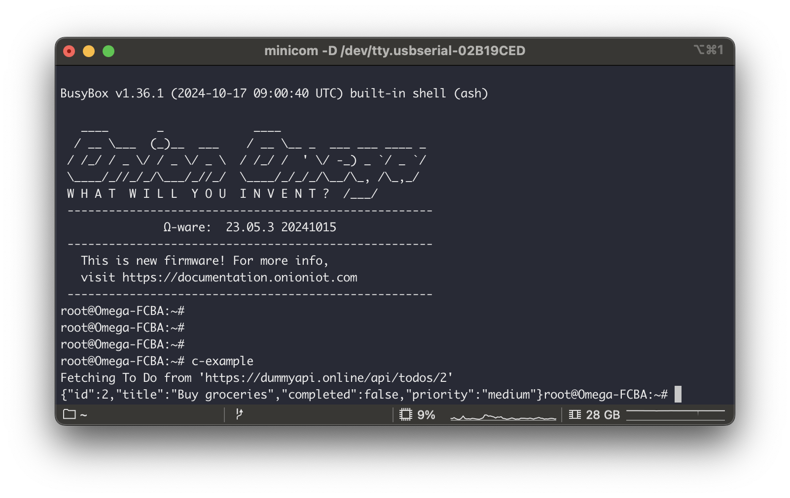

import { GiscusDocComment } from '/src/components/GiscusComment';

## Introduction

This guide will show how to compile a C program into a package for the Omega2, by using a Docker image that uses Onion's OpenWRT SDK wrapper. We'll demonstrate how this is done using a sample C program from Onion.

The C program sends an HTTP request to an API and then outputs the response to a terminal. The API response includes a To Do list item in JSON format.

### Why is this important?

This guide and the sample program provide a sure-fire way to build a C program into a package. You can use the procedure and sample code to build your own custom packages based on C programs.

Packages make deploying your own custom applications much easier as opposed to copying loose files to your devices:
- Packages can be easily installed, updated, and removed with the OPKG package manager
- The Package definition and OPKG take care of any dependencies for the application
- Versioning is built into the package definition and creation process

### Output

Onion's sample program compiled into an ipk package file you can install on an Omega using the opkg package manager.

### How long will this take?

From start to finish, the example takes 15 minutes, assuming your development computer has all the required software installed.

## Environment set up

import EnvSetup from './_package-00-env-setup.mdx';

<EnvSetup/>

## Application source code

import AppSourceCode from './_package-01-app-source-code.mdx';

<AppSourceCode/>

Onion's sample is a small C program that uses `libcurl` to send an HTTP request to an API (that returns dummy data) and outputs the response to the terminal.

#### Download the sample code

import AppSourceCodeDl from './_package-02-app-source-code-dl.mdx';

<AppSourceCodeDl/>

## Compile the sample package with Docker

import CompileWithDocker from './_package-03-compile-w-docker.mdx';

<CompileWithDocker/>

For our specific example, the command is:

```shell
bash onion_buildenv build_packages c-example
```

The `c-example` package name is defined in the package makefile: [https://github.com/OnionIoT/Example-OpenWRT-Packages/blob/main/c-example/Makefile#L6](https://github.com/OnionIoT/Example-OpenWRT-Packages/blob/main/c-example/Makefile#L6).

**This will compile the C program for the Omega2 and create an installable ipk file, as well as compile any dependencies.** For the `c-example` package, this will take about 5 minutes. It might be more or less depending on the CPU performance of your development computer.

If a package has dependencies, all the dependencies will be built as separate ipks.

:::note

The package makefile specifies the dependencies. Since `libcurl` is a dependency, this package will automatically be compiled. To learn more about the package makefile, refer to the c-example makefile on [https://github.com/OnionIoT/Example-OpenWRT-Packages/blob/main/c-example/Makefile#L20](https://github.com/OnionIoT/Example-OpenWRT-Packages/blob/main/c-example/Makefile#L20).

For additional details on the package makefile, see the [Compile a Package](../../packages/compile-package) article.

:::

import CompileWithDockerP2 from './_package-04-compile-w-docker-p2.mdx';

<CompileWithDockerP2 ipkFilename="c-example_1.0-1_mipsel_24kc.ipk"/>

## Transfer the package to Omega

import TransferIpk from './_package-05-transfer.mdx';

<TransferIpk ipkFilename="c-example_1.0-1_mipsel_24kc.ipk"/>

## Install the package

import InstallPackage from './_package-06-install.mdx';

<InstallPackage/>


To install the example package:

```shell
opkg install c-example_1.0-1_mipsel_24kc.ipk
```

Opkg will first install the dependencies and then the package.

## Run the program

import RunProgram from './_package-07-run-program.mdx';

<RunProgram/>

Look for the `Package/$(PKG_NAME)/install` block in the `c-example` package makefile: https://github.com/OnionIoT/Example-OpenWRT-Packages/blob/main/c-example/Makefile#L43


import RunProgramPathNote from './_package-08-run-program-path-note.mdx';

<RunProgramPathNote/>

To run the program type in `c-example`. The program output will be in JSON format.

```shell
root@Omega-FB94://# c-example
```

The program will run and output:

```shell
Fetching To Do from the API at: `http://dummyapi.online/api/todods/2`

{"id":2,"title":"Buy groceries","completed":false,"priority":"medium"}
```



## Next steps

You can use the information in this guide to compile other C packages or make your own!

Take a look at other C examples in the `OnionIoT/Example-OpenWRT-Packages` repo and try them out for yourself.

The `hello-world-c` is a basic C program that prints out "Hello world".

### Making your own packages

You can also try making your own C software package based on the hello world template.

When working on your own packages, remember to begin with the package makefile.

:::note Important notes

- Set the package name and version number at the very top.
- Any dependencies should be added to the package definition (`Package/$(PKG_NAME)`) and to the compile flags (`TARGET_LIB)`.
- Change the package installation instructions as required `define Package/$(PKG_NAME)/install`.

:::

Work on the application source code in the src directory to customize it to your application.

<GiscusDocComment />
