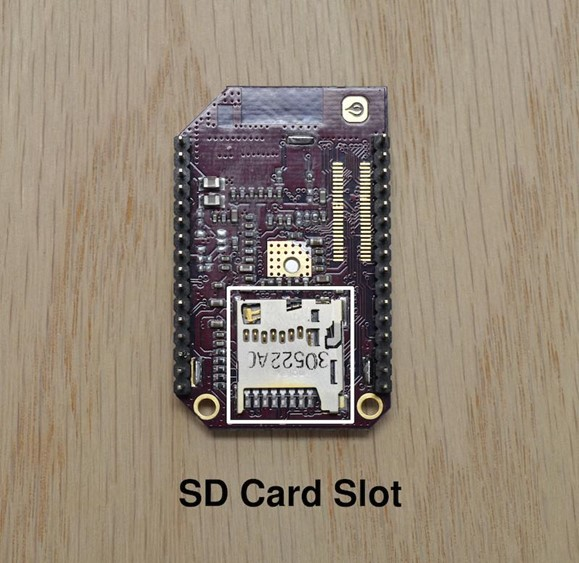
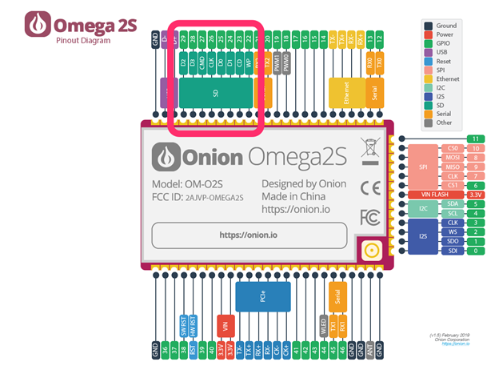

import Tabs from '@theme/Tabs';
import TabItem from '@theme/TabItem';

# SDIO / eMMC

## Introduction
The Omega2 features an SDIO/eMMC interface that enables the use of SD/MicroSD cards or eMMC storage chips.

 - **Omega2:** Does not have a microSD slot and does not expose the SDIO/eMMC interface.

- **Omega2+:** Has a microSD slot.

- **Omega2S/2S+:** Provides the SDIO/eMMC interface on exposed pins.

## Hardware
The Omega2 has a single SDIO interface.

Only one device can be specified on the interface port at design time: eMMC, SD/Micro-SD, or other SDIO.

The interface supports the SDXC specification for SD cards, with a maximum capacity of 2 TB and a maximum transfer speed of 300 MB/s. It also supports the eMMC5.1 interface for eMMC storage.

<Tabs>
  <TabItem value="omega2" label="Omega2" default>
  
  The microSD slot is highlighted on the Omega2+ photo below.




  </TabItem>
  <TabItem value="omega2s" label="Omega2S">
  
  The SDIO/eMMC pins are highlighted on the Omega2S diagram below.
  



See [Omega2S hardware design guide](https://github.com/OnionIoT/Omega2/blob/master/Documents/Omega2S%20Hardware%20Design%20Guide.pdf) for more information and recommendations on designing boards with microSD card slots or eMMC.

  </TabItem>
</Tabs>

## SD Card
When you insert an SD Card into the microSD slot you will see a message like the following:
```
[2757.012387] mmc0: new high speed SDHC card at address 0007
[2757.026510] mmcblk0: mmc0:0007 SD8GB 7.21GiB
[2757.033860] mmcblk0: p1
```

### Mounting the file system
The file system from the SD card will be automatically mounted to the `/mnt/` directory, with the name of the device and the file system partition name as the full path, so `/mnt/mmcblk0p1` in this case:
```
  root@Omega-F19D:/# ls -l /mnt/mmcblk0p1/
  rw-r--r   1root root     29 Nov 21 17:09 log.txt
```  

### Unmounting the file system
Before removing the SD card, you must unmount the file system.
```
umount /mnt/mmcblk0p1
```

