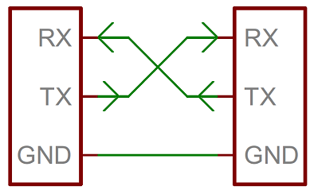
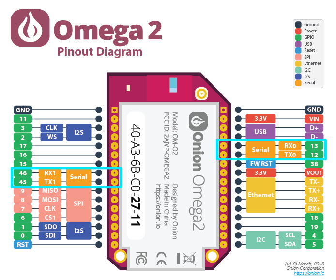

import Tabs from '@theme/Tabs';
import TabItem from '@theme/TabItem';

# UART

## Introduction
The Omega2 has two hardware serial UARTs, and the Omega2S has three hardware serial UARTs.

## Context
A **universal asynchronous receiver/transmitter (UART)** is a device used for serial communication between two devices. 

Only **two devices** can communicate with each other per UART connection. This is different from other communication protocols, such as I2C or SPI, where there may be 3, 10, or many more devices connected to the same data lines.

The UART uses the TX line to **transmit** data, and RX to **receive** data. When communicating with other devices, the TX on device A will send data to the RX on device B and vice versa.



To set up a serial line connection between two devices:

1. Connect device A’s `TX` line to device B’s `RX` line.
2. Connect device A’s `RX` line to device B’s `TX` line.
3. Connect the two devices’ `GND` lines together.

## Hardware
**Omega2/2+:** Has two 2-pin Serial UARTs available, the `UART0` and `UART1`.

**Omega2S/S+:** Has three 2-pin Serial UARTs available, the `UART0`,`UART1`, and `UART2`.
- The UART logic level is 3.3 V.
- The default bootloader and operating system use `UART0`to provide serial command line access.
- All UARTs are UART Lite controllers that do not feature hardware flow control.
- UARTs support standard **baud** rates up to 345,600 bps.

The UART pins are highlighted on the Omega2/2S diagrams below.

- On the Omega2, GPIO 12 and 13 are used for the `UART0` and GPIO 45 and 46 are used for the `UART1`.

- On the Omega2S, GPIO 12 and 13 are used for the `UART0`, GPIO 45 and 46 are used for the `UART1`, and GPIO 20 and 21 are used for the `UART2`.

<Tabs>
  <TabItem value="omega2" label="Omega2" default>

  

   </TabItem>
  <TabItem value="omega2s" label="Omega2S">


  </TabItem>
</Tabs>

## Software
UART interactions on the Omega2 are done using the virtual device files made available by `sysfs`.

Sysfs is a pseudo-file system that holds information about the Omega’s hardware in files, and lets the user control the hardware by editing the files.
-  `UART0` is accessible through `/dev/ttyS0` 
-  `UART1` is accessible through `/dev/ttyS1` 
-  `UART2` is accessible through `/dev/ttyS2` (Omega2S/2S+ only) 

### Interacting with the UART
The following features are available on the UART.

#### Command line
Using the command line tools, you can interact with the UART virtual device file to write (send) and read (receive) data.

**Sending data**

To send data on `UART1`: `echo` to `/dev/ttyS1` like so:
```
echo "my message" > /dev/ttyS1
```

The echo command will not display any text on the screen when entered, as you are simply writing to a file.  

**Receiving data**

To read data from `UART1`, run `cat` on it like so:
```
cat /dev/ttyS1 
                             # waits for input data
```   

The cat command will wait for and print any data received by the Omega2 until you exit the program (Ctrl-C).

:::tip 

The command line tools are useful for basic testing of your Omega2

:::

#### Screen Utility
The screen utility allows you to use a terminal interface with a UART. Any data that’s received will be shown immediately, and you can type in the terminal to send data.

**Installation instructions:**

To use the screen utility you’ll first need to update your packages and install the screen package using Omega’s package manager `opkg`.

To update your list of packages:
```
opkg update
```

Next, you’ll install the screen package:
```
opkg install screen
```

And now you’re ready to use `screen` with the UART!

**Usage instructions:**

To use the UART1 with `screen` enter the following command:
```
screen /dev/ttyS1 <BAUD RATE>
```

The terminal will go blank, and the command works the following way:
- Any keys or letters you type are immediately sent to the UART (ie. to the device connected to it).
- The terminal will immediately display any data received from the UART (ie. from the device connected to it).

To end a screen session, type `Ctrl-a` then `k`.

:::info 

For more information on using `screen` see [https://linux.die.net/man/1/screen](https://linux.die.net/man/1/screen). 

:::

#### Python
Onion recommends using the `PySerial` Python module to communicate through serial ports; this includes UART1 and any USB-based serial devices. 

You’ll be using Pip to install the PySerial Module. <!--For more details on Python3 and Pip, see our guide on installing and using Python on the Omega.-->

First, you’ll need to install the Python3 version of Pip.
```
opkg update
opkg install python3-pip
```

Then use Pip to install the `PySerial` module:
```
pip3 install pyserial
```

And now you’re all set to use PySerial in your Python3 programs.

:::info

For more information on using the PySerial module you can read the [PySerial documentation](https://pythonhosted.org/pyserial/shortintro.html).

:::

