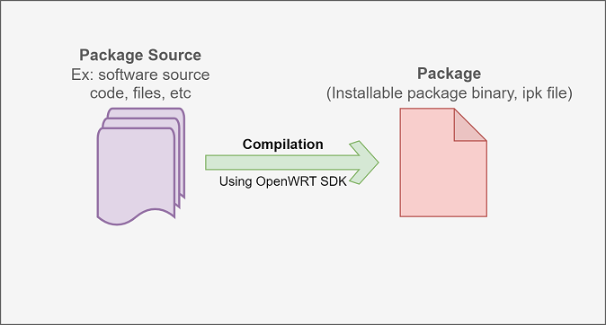
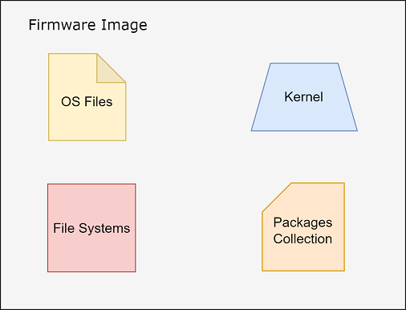

import PartialMarkdown from './_definitions_packages.mdx';
import { GiscusDocComment } from '/src/components/GiscusComment';

This chapter provides an understanding on creating software packages for Omega2 devices.
This article covers a brief explanation of the key terms that are essential to understand when dealing with OpenWRT packages.

## Packages

Packages are archives that bundle software applications and contain compiled binaries, configuration files, and metadata like dependencies. A package enhances the core functionality and capabilities of Omega2 device and can be installed using a package manager. A package manager provides a standardized way to install and manage software while making sure that all the dependencies are also met. 

For example, `omega2-usb-autorun` package enables the execution of predefined scripts or actions upon connecting a USB drive to Omega2 devices. This may include automatically mounting a USB drive and launching specific applications or scripts, thereby enhancing the functionality of Omega2 devices.

:::tip 
Explore the available packages developed by Onion Corporation for Omega2 devices by navigating to the [**OnionIoT**](http://repo.onioniot.com/omega2/packages/openwrt-22.03.5/onion/) package repo. You will see a list of packages compatible with Omega2 devices, which can be easily downloaded and installed using the package manager.
:::

<!-- refer .xml file to edit this diagram in draw.io

packages/assets/packages-diagram.xml
 -->

**Context:** A note on architecture and packages

Omega2 device is based on the `mipsel_24kc` architecture, and it exclusively supports packages created for this architecture. Following are the components of the `mipsel_24kc.ipk` package architecture:

- **mipsel:** Refers to processor architecture. It stands for 'Microprocessor without Interlocked Pipeline Stages, Little Endian.' The Omega2 features a Little Endian MIPS Processor

- **24kc:** Refers to the CPU type. In this case, it is a **32-bit RISC** (Reduced Instruction Set Computing) core within the MIPS architecture, used for high-performance applications 

- **.ipk Format:** Represents an IPK (Itsy Package) file, a packaging format for software distribution. It is designed for Linux-based systems, especially in embedded devices.

Please refer to the [**OpenWRT**](https://openwrt.org/packages/start) documentation to get detailed information on packages that are supported by OpenWRT-based firmware devices.

## Why are Packages Helpful?

- **Capabilities Enhancement:** Packages offer access to a wide range of pre-built functionalities and tools. Hence, instead of building from scratch, developers can incorporate the existing packages to extend the capabilities of the project.

- **Easy Installation & Management:** Packages make it easy to install and manage software components. A package can be easily installed using package managers like OPKG, similar to `apt-get` in Ubuntu Linux, which automatically manages dependencies and updates.

- **Offers Standardisation:** Packages provide a standardized way of organizing and sharing code. They help to ensure that code is consistent across different projects and teams, making it easier to maintain and update.

## Firmware

Firmware is a software program that is embedded into hardware devices. It is similar to an operating system, such as MacOS or Windows, installed on a computer. Once the device boots up, the firmware acts as the complete operating system for a Linux device that performs all control, monitoring, and data manipulation functions.

Firmware is created by assembling packages around a Linux kernel to produce a firmware image. This firmware image contains all the essential components that can be loaded onto a device, such as the Linux kernel, Wi-Fi drivers, text editor, and standard packages to enhance usability.

The firmware image is then typically flashed into non-volatile memory on devices, and is started by the bootloader when the device is powered on.

The four components of the Omega2 firmware image are explained below:

<!-- refer .xml file to edit this diagram in draw.io

packages/assets/firmware-image-diagram.xml
 -->

**Context:** Firmware Components

- **OS Files:**
    OS files are part of the software that runs on a computer. They help manage and organize all the computer's resources and act as a bridge between the software and the actual hardware.

- **Kernel:**
    The kernel is a main part of the firmware that acts as a link between user programs and hardware devices. It mainly manages the communication between software applications and hardware like the CPU, disks, and memory.
    
    The Device Tree is a hierarchical data structure that describes the hardware configuration of a system during the Linux boot process. The kernel uses the Device Tree to discover the hardware topology at runtime, allowing it to support a wide range of hardware without hard-coding specific details into the kernel. 

- **File Systems:**
    A file system organizes and manages data on a storage device and defines how files are named, stored, and retrieved from a storage device.

- **Packages Collection:** 
    Packages collection refers to the packages included in the firmware image. When the firmware image is installed on a device, these packages are also installed on the device, which extends the functionality of the firmware and application software.

## OPKG

OPKG is a lightweight package management system based on ipkg (Itsy Package Management System), specifically designed for embedded devices such as Omega2. It is used to download, install, update, and remove software packages on the device. It resolves dependencies, reports errors, and prevents unreliable installations in Omega2 devices. Moreover, OPKG allows to list available packages, display package details, and filter packages as needed.

:::info
OPKG can be configured to fetch packages from OpenWRT packages repos, including Onion package repo.
:::

:::note
For more information on how to use the OPKG package manager, refer to the [**OPKG Package Manager**](https://documentation.onioniot.com/packages/opkg-package-manager/) chapter.
:::

## Package Source Code

The package source code is the collection of code and related files forming a software package. It may or may not be compiled before being put into a package. The package source code is used to generate packages during the compilation process using the OpenWRT SDK or build system. It includes a Package Makefile, application source files, and additional configuration files or utilities.

The package Makefile acts as the central blueprint for the packages, specifying details such as the package name, version, compilation instructions needed for building the package, and additional instructions.

<!-- :::tip 
For a detailed guide on Package Source Code, refer to [**Package Source Code**](chapter link will be added in another iteration) chapter.
::: -->

## Installable Package Binary (IPK files)

When the package source is compiled, it becomes an Installable Package (IPK) binary and is used for distributing software packages on OpenWRT-based firmware. These files contain the necessary binaries and metadata files for the package installation.

The IPK files can be added to a package repository and users can install these packages on the Omega2 devices directly from the package repository using OPKG.

## Package Repo

A Package Repository (Package Repo) is online storage for software packages that are made available for users to install on their devices using OPKG. Package repos contain collections of software packages.

:::tip

To explore an example repo, see the [**OnionIoT packages**](http://repo.onioniot.com/omega2/packages/openwrt-22.03.5/onion/) repo.

:::

## Package Feed

A package feed is a collection of package sources (software files, libraries, feeds, and scripts). The package sources are stored in a publicly or privately accessible source code repository. It acts as input when building packages using OpenWRT SDK or build system. 

During the package compilation process, the build system verifies dependencies and retrieves necessary files from the package feed. Subsequently, it proceeds to compile, link, and package software components according to the chosen packages and configurations. Finally, the build system utilizes the package feeds to generate an executable package.

:::tip
For a detailed guide on the package feed, refer to [**OpenWRT**](https://openwrt.org/docs/guide-developer/feeds#feed_configuration) official documentation.
:::

<!-- chapters card -->

import DocCardList from '@theme/DocCardList';

<!-- This section of the documentation deals with OpenWRT Packages. -->

<!-- importing content from definition markdown file (reference: https://docusaurus.io/docs/markdown-features/react#importing-markdown) -->

<PartialMarkdown/>

## Articles in this section

<DocCardList />

<GiscusDocComment /> 