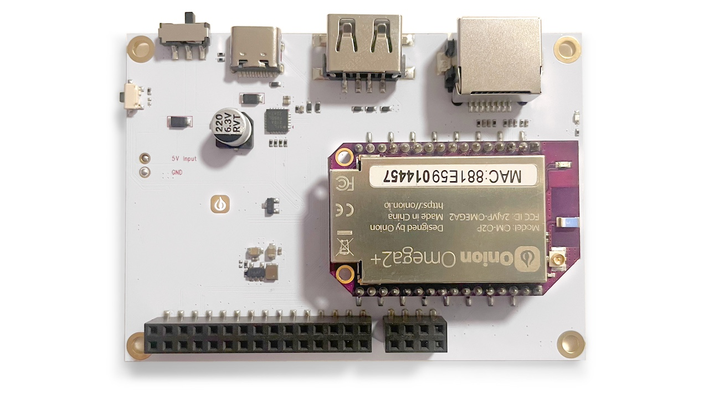

import { GiscusDocComment } from '/src/components/GiscusComment';

The Omega2 Eval Board is a stand-alone single board computer meant for evaluating and working with the through-hole Onion Omega2 modules. 

Almost all of the Omega2's capabilities and I/O are available, making it an essential tool for evaluation, prototyping, and development. This board can serve as template for custom designs and even as a standalone SBC for custom applications.

## Resources

Resources for working the with Omega2 Eval Board

### Quickstart Guide

A quickstart guide and an accompanying video is available to help get users up and running with the Omega2 Eval Board.

[See the Quickstart Guide](/quickstart/intro)

### Hardware Design

The Omega2 Eval Board design is open source and can be found in the [OnionIoT/Omega2-Eval-Boards GitHub repo](https://github.com/OnionIoT/Omega2-Eval-Boards)

## Hardware 

### Overview

|                                   |                       |
|-----------------------------------|-----------------------|
| **A.** 30-pin I/O Header                        | **H.** Ethernet Port     |
| **B.** MicroSD Slot (underneath)                | **I.** Mounting Hole |
| **C.** External Power Connector                 | **J.** User Programmable LED |
| **D.** Reset Button                             | **K.** Status LED    |
| **E.** Power Switch                             | **L.** WiFi Antenna |
| **F.** USB-C Port (Power & Serial Command Line) | **M.** Omega2+ Module                  |
| **G.** USB Type-A Host Port | **N.** 8-pin I/O Header |

Included with the Omega2 Eval Board is an [Onion Omega2+ module (OM-O2P)](/product-overview/omega2).

### Pins

The Omega2 Eval Board exposes all of the I/O available on the Omega2 through: 
- The 30-pin Header (backwards compatible with all Omega2 Expansions)
- The **new** 8-pin header

For more information on using the Hardware Interfaces chapter on this Documentation site.

### USB-C Port

import Omega2EvalUsbcPort from './_omega2-eval-usb-c-port.mdx';

<Omega2EvalUsbcPort device="Omega2 Eval Board"/> 

### Ethernet Port

import Omega2EvalEthernetPort from './_omega2-eval-ethernet-port.mdx';

<Omega2EvalEthernetPort device="Omega2 Eval Board"/>

### USB Type-A Port

import Omega2EvalUsbHostPort from './_omega2-eval-usb-host-port.mdx';

<Omega2EvalUsbHostPort/>

### MicroSD Slot

import Omega2MicrosdSlot from './_omega2-microsd-slot.mdx';

<Omega2MicrosdSlot/> 

The card slot is not on the Eval Board itself, but located on the bottom of the Omega2+:

### Power Switch

import Omega2EvalPowerSwitch from './_omega2-eval-power-switch.mdx';

<Omega2EvalPowerSwitch/> 

### Reset Button

import Omega2EvalResetButton from './_omega2-eval-reset-button.mdx';

<Omega2EvalResetButton/> 

### Omega2 System Status LED

The Omega2's amber LED is located on the Omega2 module 
itself and indicates the current System Status. 

import Omega2Led from './_omega2-led.mdx';

<Omega2Led/>

### User Programmable LED

import Omega2EvalUserLed from './_omega2-eval-user-led.mdx';

<Omega2EvalUserLed device="Omega2 Eval Board" gpio="15"/> 

### External Power Connector

import Omega2EvalPowerConnector from './_omega2-eval-power-connector.mdx';

<Omega2EvalPowerConnector device="Omega2 Eval Board"/> 

### WiFi Antenna

import Omega2WifiAntenna from './_omega2-wifi-antenna.mdx';

<Omega2WifiAntenna/> 

