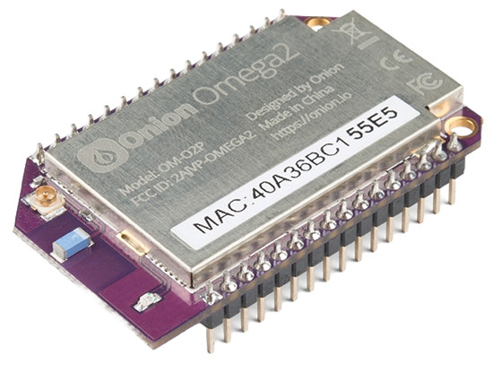
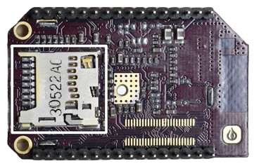

import { GiscusDocComment } from '/src/components/GiscusComment';

Onion’s Omega2 is an embedded module designed to provide drop-in computing and connectivity functionality for IoT devices and applications. The module has two variants, the Omega2 and Omega2+.

## Variants

Both variants come with built-in WiFi, a Linux operating system, flexible GPIOs, and a powerful processor. The Omega2+ has a larger memory module and additional storage.

| Specifications | Omega2          | Omega2+         |
| :------------- | :-------------- | :-------------- |
| Processor      | 580MHz MIPS CPU | 580MHz MIPS CPU |
| Memory         | 64MB            | **128MB**       |
| Storage        | 16MB            | **32MB**        |
| USB  2.0       | 1               | 1               |
| MicroSD slot   | No              | **Yes**         |
| WiFi adapter   | b/g/n Wi-Fi     | b/g/n Wi-Fi     |
| GPIOs          | 18              | 18              |
| PWM            | 2               | 2               |
| UART           | 2               | 2               |
| I2C            | 1               | 1               |
| SPI            | 1               | 1               |
| I2S            | 1               | 1               |

## Resources

### Omega2 Datasheet

For details on the Omega2 embedded module, see the datasheet on GitHub: https://github.com/OnionIoT/Omega2/blob/master/Documents/Omega2%20Datasheet.pdf

### Omega2S Hardware Design Guide

If you plan to develop custom hardware using the Omega2 modules, please use the Omega2S hardware design guide for reference. While not everything from the guide is relevant to designing hardware with the Omega2 through-hole modules, it is a useful reference.

Find the guide on GitHub: https://github.com/OnionIoT/Omega2/blob/master/Documents/Omega2S%20Hardware%20Design%20Guide.pdf

### Processor Datasheet

For details on the Omega2's processor, see the datasheet on GitHub: https://github.com/OnionIoT/Onion-Docs/raw/master/Omega2/MT7688_Datasheet_v1_4.pdf

### Operating System

Both the Omega2 and Omega2+ run the OpenWRT Linux operating system. OpenWRT is great for embedded Linux and networking applications. It includes the OPKG package manager. With OPKG you can download and install a variety of packages to extend the functionality of your device.

See our latest [release notes](https://github.com/OnionIoT/OpenWRT-Packages/releases) for more information on Omega2's current OS version.

## Hardware

At the Omega2’s core is the MT7688 SoC. It features a 580 MHz MIPS CPU, supports 2.4 GHz IEEE 802.11 b/g/n WiFi as well as 10M/100M wired Ethernet network connectivity, and operates at 3.3Vdc.

Onion built the Omega2 to interact with other hardware. It has a wide variety of hardware interfaces, and you can use up to 18 pins as user-controllable GPIOs.

Omega2 supports the following hardware-based serial communication protocols:

- I2C bus
- 2 UARTs
- 2 PWM channels

Omega2 has dedicated pins for:

- USB 2.0
- Ethernet
- SPI

### Pins

Please refer to the following articles to learn more about Omega2's GPIO's, multiplexing GPIO functionality, as well as the behavior and requirements of Special pins.

- [Pinouts](/hardware-interfaces/pinouts)
- [GPIO](/hardware-interfaces/gpio)
- [Pin multiplexing](/hardware-interfaces/pin-multiplexing)
- [Special pins](/hardware-interfaces/special-pins)

### Omega LED

Omega2's amber system status LED provides a visual indication of its current state. The Omega2 LED uses GPIO44, and you can program it to do several interesting things. To learn more about the Omega2's LED, see the article [LED Chains](/hardware-interfaces/ledchain).

### Reset GPIO

You can reset the Omega2/2+ using GPIO38. When plugged into a dock, such as an Expansion Dock, this GPIO provides various functions to the reset button found on docks.

- Single quick button press – triggers a reboot command.
- Long button press (10 sec) – triggers a factory reset.

### MicroSD Card Slot

The MicroSD card slot is only available on the Omega2+ variant. It allows for extending the available storage.

The card slot is located on the bottom of the Omega2+. To mount a MicroSD card, insert it into the slot, then push it down to secure it.

For more information on using the MicroSD card slot, see the [SDIO article](/hardware-interfaces/sdio).

### WiFi Antenna

The Omega2/2+ WiFi antenna is an on-board ceramic surface-mount chip antenna. The WiFi signal can travel up to 100m (300ft) line-of-sight outdoors.

For more information on the WiFi antenna, see the [Antenna and uFL connector article](/hardware-interfaces/wifi-antenna).

### Mechanical Drawing

The following are detailed [diagrams](./omega2-mechanical) of the dimensions and geometry of the Omega2 and Omega2+ embedded modules.

<GiscusDocComment />
