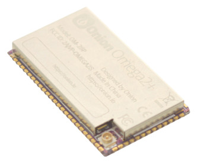
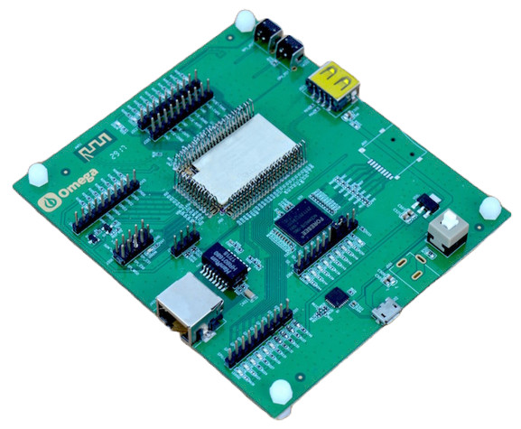

import { GiscusDocComment } from '/src/components/GiscusComment';

Onion’s Omega2S is a smaller, surface-mount packaged version of the through-hole Omega2. It is designed to provide drop-in computing and connectivity for IoT devices and applications. The module has two variants, the Omega2S and Omega2S+.

## Variants

Both variants come with built-in WiFi, a Linux operating system, flexible GPIOs, and a powerful processor. The Omega2S+ has a larger memory module and extra storage.

| Specifications | Omega2S         | Omega2S+        |
| :------------- | :-------------- | :-------------- |
| Processor      | 580MHz MIPS CPU | 580MHz MIPS CPU |
| Memory         | 64MB            | **128MB**       |
| Storage        | 16MB            | **32MB**        |
| USB 2.0        | 1               | 1               |
| SD/eMMC        | 1               | 1               |
| Ethernet       | 1               | 1               |
| WiFi adapter   | b/g/n Wi-Fi     | b/g/n Wi-Fi     |
| GPIOs          | 37              | 37              |
| PWM            | 4               | 4               |
| UART           | 3               | 3               |
| I2C            | 1               | 1               |
| SPI            | 1               | 1               |
| I2S            | 1               | 1               |

## Differences from Omega2

Onion's Omega2S is ideal for high volume production with its low profile, extended feature set, and production friendly design.

| Omega2                                | Omega2S                                      |
| :------------------------------------ | :------------------------------------------- |
| Plug-in module                        | Surface-mount module                         |
| 42.9 x 26.4 x 9.9mm                   | 34 x 20 x 2.8mm (low profile)                |
| 32 pins                               | 63 pins                                      |
| MicroSD slot                          | Pins for SD/eMMC on pinout                   |
| 2 UARTs                               | 3 UARTs                                      |
| 2 PWM channels                        | 4 PWM channels                               |
| --                                    | Exposes SPI Chip-Select 0 (CS0) pin          |
| On-board antenna                      | Antenna signal pin and U.FL connector        |
| On-board system status LED            | System status pin to connect an external LED |
| Built-in pull-up resistors on I2C bus | Requires external pull-up resistors          |

## Resources

### Omega2S Datasheet

For further details on the Omega2S module, please see the datasheet on GitHub: https://github.com/OnionIoT/Omega2/blob/master/Documents/Omega2S%20Datasheet.pdf

### Omega2S Hardware Design Guide

If you plan to develop custom hardware using the Omega2S modules, please refer to our hardware design guide on GitHub site: https://github.com/OnionIoT/Omega2/blob/master/Documents/Omega2S%20Hardware%20Design%20Guide.pdf

### Omega2S Development Kit

The Omega2S development kit lets you evaluate the Omega2S module's functionality and start developing your IoT product.

The kit includes:

- Easy insertion socket for the Omega2S module
- USB, Micro-USB, and Ethernet connectors
- Connector pins for all Input/Output signals
- Dual reset functions

The development kit is available in two versions.

| SD Card Slot Version (OM2S-DK-SD) | eMMC Storage Version (OM2S-DK-EM) |
| :-------------------------------- | :-------------------------------- |
| 8 GB Micro SD Card                | Built-in 8GB eMMC                 |
| Two (2) Omega2S modules           | Two (2) Omega2S modules           |
| Two (2) Omega2S+ modules          | Two (2) Omega2S+ modules          |
| 2 dBi uFL Tape Antenna            | 2 dBi uFL Tape Antenna            |
| Micro USB Cable                   | Micro USB Cable                   |
| Ethernet Cable                    | Ethernet Cable                    |

## Hardware

At the Omega2S’ core is the MT7688 SoC. It features a 580 MHz MIPS CPU, supports 2.4 GHz IEEE 802.11 b/g/n WiFi as well as 10M/100M wired Ethernet network connectivity, and operates at 3.3Vdc.

Onion built the Omega2S to interact with other hardware. It has a wide variety of hardware interfaces, and you can use up to 42 pins as user-controllable GPIOs.

Omega2S supports the following hardware-based serial communication protocols:

- I2C bus
- 3 UART's
- 4 PWM channels

Omega2S has dedicated pins for:

- USB 2.0
- Ethernet
- SPI

### Pins

Please refer to the following articles to learn more about Omega2S' GPIO's, multiplexing GPIO functionality, as well as the behavior and requirements of Special pins.

- [Pinouts](/hardware-interfaces/pinouts)
- [GPIO](/hardware-interfaces/gpio)
- [Pin multiplexing](/hardware-interfaces/pin-multiplexing)
- [Special pins](/hardware-interfaces/special-pins)

### WiFi antenna

The Omgea2S supports 2.4 GHz IEEE 802.11 b/g/n WiFi with a maximum 150 Mbps PHY rate.

For more information on the WiFi antenna, please see the [Antenna and uFL connector article](/hardware-interfaces/wifi-antenna).

### Mechanical drawing

The following is a detailed [diagram](./omega2s-mechanical) of the dimensions and geometry of the Omega2S and Omega2S+ modules.

<GiscusDocComment />
