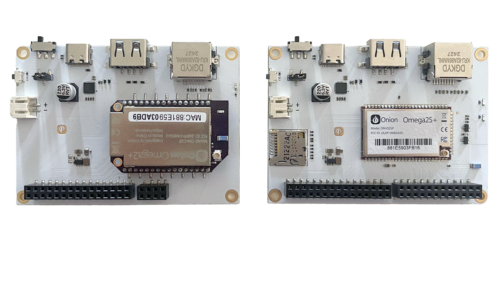

<!-- NOTE: Ok to keep OpenWRT release numbers hard-coded in this article -->

This quickstart guide covers the quickest way to get up and running with an Omega2 Device. It applies to all Omega2 devices running the updated firmware, which is based on OpenWRT 23.05.

### Upgrading from v0.3.4 firmware

For devices running the Omega2 firmware v0.3.4, please see the instructions found in the [Installing the New Firmware](/firmware/installing-firmware) article and then return to this article.

> To get started with a device running the v0.3.4 firmware, please see the [first time setup article in our legacy documentation](https://docs.onion.io/omega2-docs/first-time-setup.html). **Note the legacy first time setup will not work with the new firmware!**

If you're unsure how to tell the difference between the "New" firmware and the previous v0.3.4 firmware, see the [article on identifying the firmware version](../introduction/determine-fw-version).

### Recommended hardware

For ease of use, Onion recommends using the Omega2 Eval Boards:

1. The Eval Boards are the new starting point for working with the Omega2 modules and expose almost all of the Omega's functionality
2. The Eval Boards come pre-loaded with the latest firmware based on OpenWRT 23.05 

*Omega2 Eval Board (left) and Omega2S Eval Board (right)*

:::caution Other Hardware

If you are using other hardware that's running the new firmware, please see [onion.io/getstarted](https://onion.io/getstarted) for guides on the initial unboxing and harware setup. Then continue with this quickstart guide. Let us know in the article comments if you run into any issues!

:::

#### Additional required materials

In addition to the Omega device, you will also need:
- A computer
- USB-C cable *to connect the Omega to the computer*

### Overview of the process

In this first article, we cover the unboxing and powering up of your Omega2. Then we’ll cover connecting to the Omega’s command line and WiFi in separate articles within the QuickStart section. Finally, we'll explore running a Hello World demo program using Python.

1. [Unbox your Omega2 and connect to your computer](./power-up)
1. [Connect to the command line over the USB serial connection](./serial-command-line)
1. [Connect to WiFi](./setup-wifi)
1. [Run a Hello World Program](./hello-world-demo)