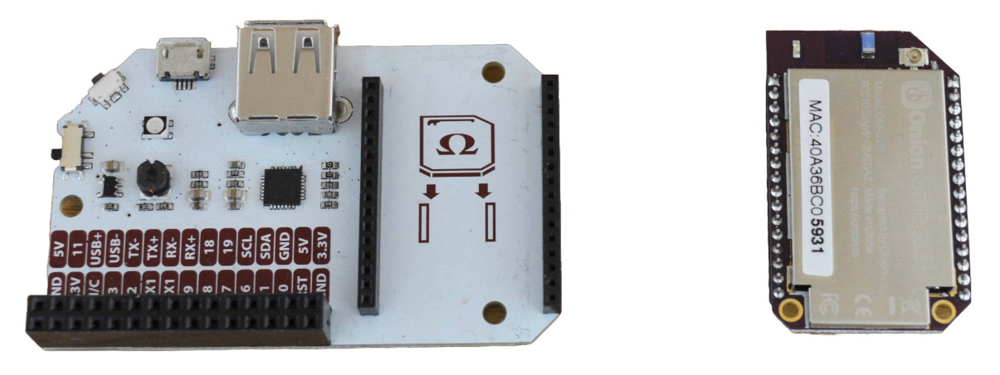
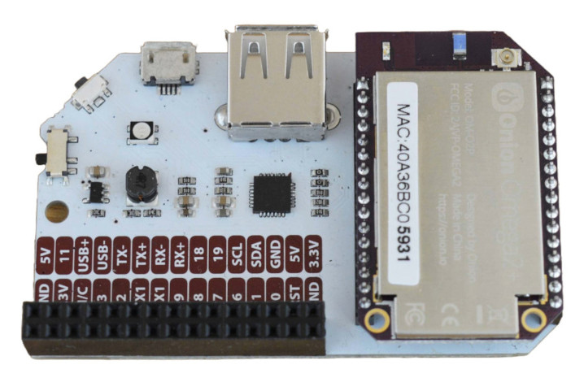
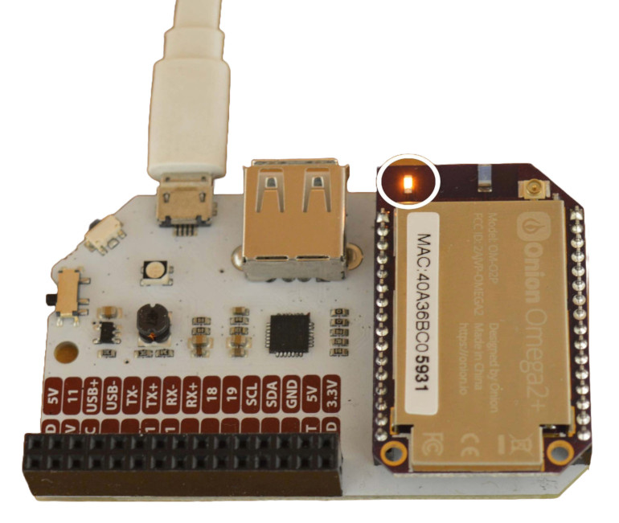

import { GiscusDocComment } from '/src/components/GiscusComment';

Next, we'll cover unboxing the device, powering it on, and connecting it to your computer.

## Unpack the device

Unpack your Omega2 Eval Board

### Ensure the Omega is plugged in to the Eval Board 

**Through-hole Omega2 only**

Make sure the Omega2 is plugged into the socket on the Eval Board and the Omega's pins are securely seated in the socket.

:::info

On the Omega2S Eval Board, the surface-mount Omega2S module is soldered down to the Eval Board, so this step is not necessary.

:::

## Connect the Eval Board to a computer

Plug the USB cable into the USB-C port on the Omega2 Eval Board and connect the other end to a USB port on your computer. This provides power to the Omega as well as a connection with Omega2’s command line.

:::note

The Omega2 Eval Boards have voltage regulators so the USB port can power the Omega2 with the required 3.3Vdc.

:::

## Power on

Turn on your Omega2 using the switch.

### Wait until it boots

The amber LED on your Omega2 should turn on and start blinking after about 10 seconds. The LED will stop blinking and remain solid after about a minutes. This means your Omega2 has completed its boot sequence.

<!-- TODO: check if amber LED takes 10s to start blinking -->

Congratulations, your Omega2 is now powered up and you're ready to further explore your device.

<GiscusDocComment />
