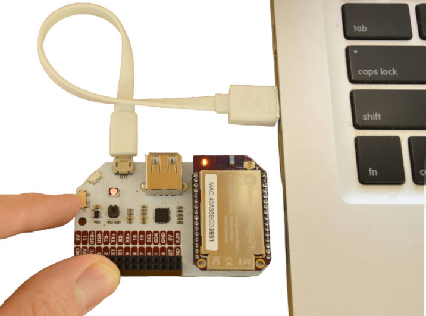

import { GiscusDocComment } from '/src/components/GiscusComment';

## Unbox and hardware setup

This section assumes you have an Omega2 device and an Expansion dock. If you didn't purchase an Expansion dock, see our guide on [powering the Omega without a dock](https://docs.onion.io/omega2-docs/hardware-prep-no-dock.html#hardware-prep-no-dock).

### Unpack the device

Unpack your Omega2 and Expansion Dock from their boxes.

### Connect the device

Plug your Omega2 into the socket on the Expansion Dock, making sure the Omega2’s pins are securely seated in the socket.

### Connect the dock to a computer

Plug the microUSB cable into your Omega2 and connect the other end to the USB port on your computer. This provides power to the Omega2 as well as a connection with Omega2’s command line utility.

All Omega Docks have voltage regulators so the USB port can power the Omega2 with the required 3.3Vdc.

### Power on

Turn on your Omega2 using the switch.

### Wait until it boots

The amber LED on your Omega2 should turn on and start blinking after about 10 seconds. The LED will stop blinking and remain solid after about a couple of minutes. This means your Omega2 has completed its boot sequence.

Congratulations, your Omega2 is now powered up and you're ready to further explore your device.

:::note

If the amber LED on your Omega2 turns on and stays on, wait for a minute to allow your Omega2 to complete its boot.

:::

<GiscusDocComment />
