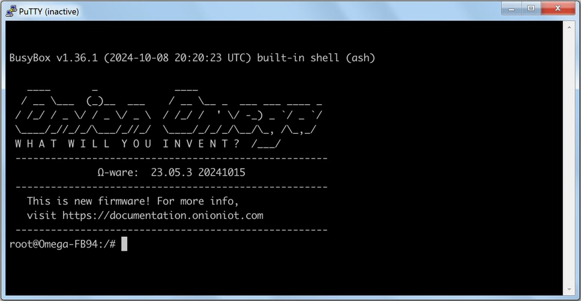
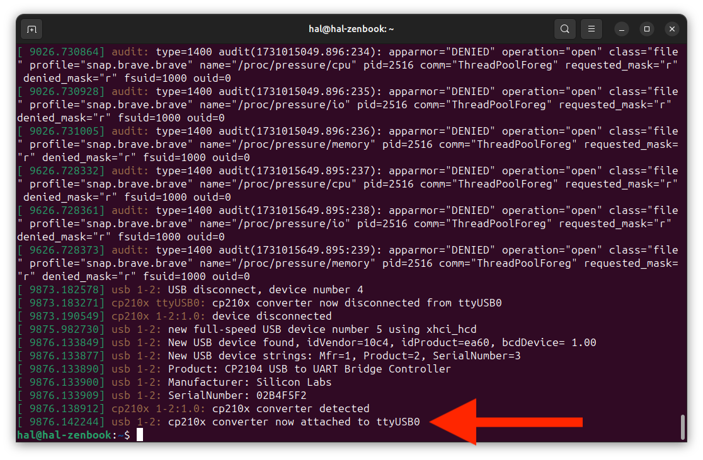
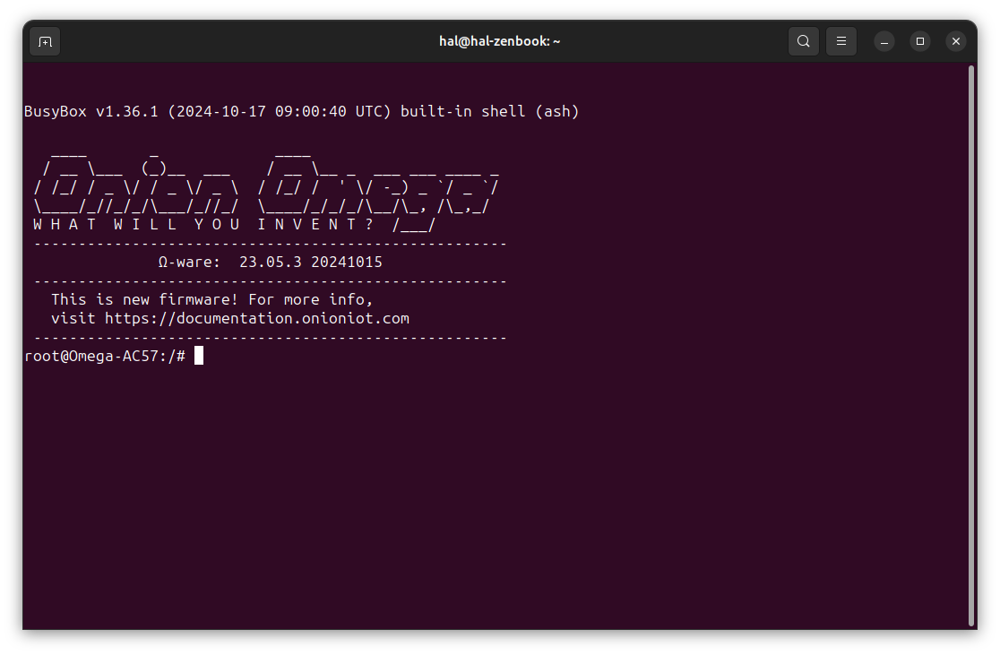

import Tabs from '@theme/Tabs';
import TabItem from '@theme/TabItem';
import { GiscusDocComment } from '/src/components/GiscusComment';

Now, we'll dicscuss how to connect to the Omega's command line over USB.

## Context

The Serial Command Line terminal interface is ideal for configuration and debugging during early development. The serial command line is always accessible if the device is on. There is no need to rely on a network connection, like there is with SSH connections. For Omega devices in production environments or with stable network connections, SSH is a valid alternative to securely access the command line through the local network.

The Omega’s Serial Command Line interface is accessible on UART0. On hardware with an on-board USB-to-Serial chip - like the Omega2 Eval Boards - the serial command line can be accessed over USB. The USB-to-Serial chip translates the UART serial terminal signals into USB signals that your computer can understand and vice versa.

:::caution

Keep in mind the serial command line can only be accessed on hardware with a USB-to-Serial chip. This includes the Omega2 Eval Boards, Omega2 Pro, Omega2 LTE, Omega2 Dash, Omega2S Development Kit, Expansion Dock, and Mini Dock

:::

## Step 1: Install USB-to-Serial driver on your computer

You'll need to download and install the Serial-to-USB driver on your computer for your specific operating system.

<Tabs>
 <TabItem value="Mac OS Serial Driver" label="Mac OS Serial Driver" default>

Download and install the [Silicon Labs CP210x driver for Mac OS](https://www.silabs.com/Support%20Documents/Software/Mac_OSX_VCP_Driver.zip).

 </TabItem>
 <TabItem value="Windows Serial Driver" label="Windows Serial Driver">

Download and install the [Silicon Labs CP210x driver for Windows](https://www.silabs.com/Support%20Documents/Software/CP210x_VCP_Windows.zip).

 </TabItem>
 <TabItem value="Linux Serial Driver" label="Linux Serial Driver">

Most modern Linux distributions include the CP210x driver by default, so there is no need to install it. 

#### Confirm the Serial Driver is Installed

Run `modinfo cp210x` on the command line. If it outputs several lines of information, then the driver is installed, and you can skip to Step 4.

If the output displays an error like the following: 

```shell
modinfo: ERROR Module cp210x not found
```

Then the driver needs to be installed. Drop a comment in this article with the name and version of the Linux distribution you're using, and we'll do our best to help out!

#### Enable the Serial Device for the user

To make the device accessible to the user you'll need to run a few additional commands with the Omega2 Eval Board plugged in

```shell
sudo usermod -a-G dialout $USER
sudo usermod -a-G tty $USER
sudo chmod 666 /dev/ttyUSB0
```

:::note

This only needs to be done once

:::

 </TabItem>
</Tabs>

## Step 2: Connect to the Omega's Command Line

Before connecting to your Omega2 you'll need to check that the serial device exists.

<Tabs>
 <TabItem value="Mac OS" label="Mac OS" default>

In this example, we will use the `screen` utility to connect to the Omega's serial command line. There are other tools available but screen is simple and comes already installed on most Macs.

Open a terminal on your Mac, and then follow these steps. 

#### Step 1: Check for the serial device

Plug in your Omega2 Eval Board, then run `ls /dev/tty.*` to see if the USB-to-Serial device is detected. If the driver is installed, you should see a device with a name like `/dev/tty.usbserial-02B4E355`. Note the device name, keep in mind **the last 7 digits of the device name are unique!** 


:::info

The Omega2 Eval Boards use the newer CP2104 USB-to-Serial chip so the serial device name is unique. Previous boards with the CP2102 chip will still use the `/dev/tty.usbserial-0001` device name. Make sure to use the device name that corresponds to your device.

:::

#### Step 2: Connect to Omega2

To connect to the Omega's serial terminal using the screen utility, run the following command using the device name from the previous step:

```
screen /dev/tty.usbserial-<UNIQUE DIGITS FROM STEP 1> 115200
```

In this example, the command would be:

```
screen /dev/tty.usbserial-02B4E355 115200
```

#### Step 3: Confirm connection is successful

Press Enter again and, if the connection is successful, you should see the following:


#### Step 4: Closing screen

:::tip 

Of course, you don't need to do this right away. We wanted to let you know how to close the screen session. For best results, close the screen session before disconnecting the device.

:::

After you've finished with the command line you can close the session by pressing the action key (Ctrl-a) then k.

For information on how to use the screen utility, please see this [tutorial](https://www.linode.com/docs/networking/ssh/using-gnu-screen-to-manage-persistent-terminal-sessions).

:::info

Another useful serial port communication program is [Minicom](https://wiki.emacinc.com/wiki/Getting_Started_With_Minicom).

:::

 </TabItem>
<TabItem value="Windows" label="Windows">

We'll be using PuTTY as our terminal, but you can use any terminal program that you like. Download and install [PuTTY](http://www.chiark.greenend.org.uk/~sgtatham/putty/download.html) on your computer, and then follow these steps.

#### Step 1: Find the serial device

Plug in your Omega2 and Expansion dock and run the Device Manager (Start > Enter "Device Manager" and press **Enter**). Look for Silicon Labs CP210x USB to UART Bridge under Ports (COM & LPT). Take note of the Com number in brackets.


#### Step 2: Configure the terminal program

- Open PuTTY and select **Serial** for the Connection type.
- Enter the **COM number noted in Step 1** as the Serial line.
- Enter **115200** as the Speed.


#### Step 3: Connect to Omega2

Click the **Open** button to connect to your Omega2 via PuTTY. You should see the following screen if the connection is successful.



</TabItem>
<TabItem value="Linux" label="Linux">

In this example, we will use the `screen` utility to connect to the Omega's serial command line. 

#### Step 1: Install screen

Next, we'll install screen, a command line utility that allows connecting to the Omega2's serial terminal.

<Tabs>
 <TabItem value="Ubuntu/Debian" label="Ubuntu/Debian" default>

```shell
 sudo apt-get update
 sudo apt-get upgrade
 sudo apt-get install screen
 ```
 
 </TabItem>
<TabItem value="RedHat/CentOS" label="RedHat/CentOS">

```shell
sudo yum update
sudo yum install screen
```

 </TabItem>
</Tabs>


For more information on how to use the screen utility, please see this [tutorial](https://www.linode.com/docs/networking/ssh/using-gnu-screen-to-manage-persistent-terminal-sessions).

#### Step 2: Find the USB-to-Serial device

Plug in your Omega2 Eval Board and run `sudo dmesg` to check the kernel log messages. If the driver is installed, you should see a message about the new USB device.



The `cp210x converter now attached to ttyUSB0` line is what interests us. Note the `ttyUSB0` device name for the next step.

#### Step 3: Connect to Omega2

To connect to the Omega's serial terminal using the screen utility, run the following command using the device name from the previous step:

```
screen /dev/ttyUSB0 115200
```

#### Step 4: Confirm connection is successful

Press Enter again and, if the connection is successful, you should see the following:



#### Step 5: Closing screen

:::tip 

Of course, you don't need to do this right away. We wanted to let you know how to close the screen session. For best results, close the screen session before disconnecting the device.

:::

After you've finished with the command line you can close the session by pressing the action key (Ctrl-a) then k.

For information on how to use the screen utility, please see this [tutorial](https://www.linode.com/docs/networking/ssh/using-gnu-screen-to-manage-persistent-terminal-sessions).

 </TabItem>
</Tabs>

<GiscusDocComment />
