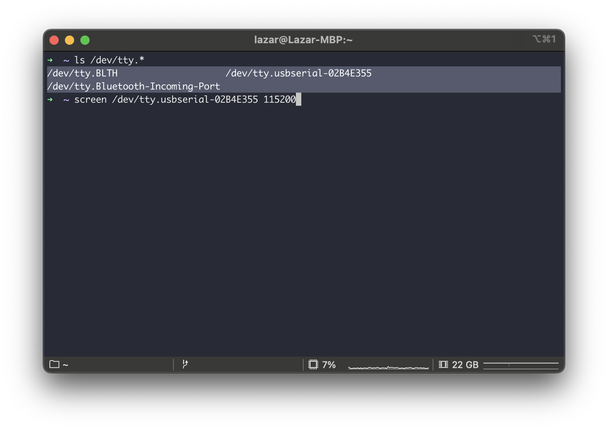
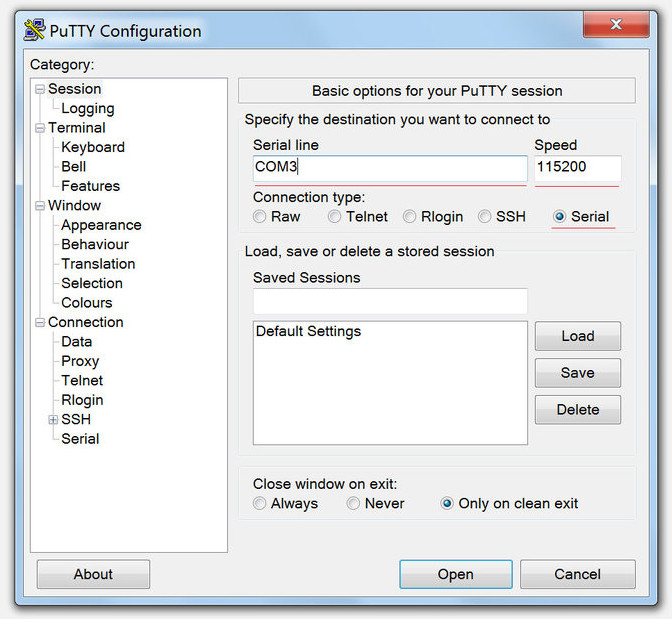
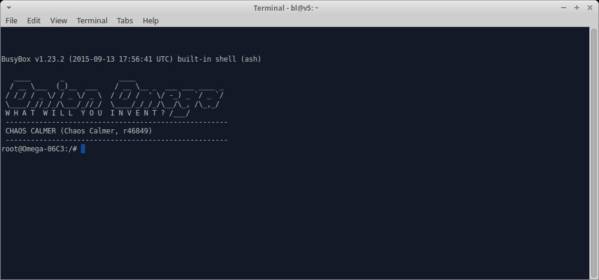

import Tabs from '@theme/Tabs';
import TabItem from '@theme/TabItem';
import { GiscusDocComment } from '/src/components/GiscusComment';

Now, we'll dicscuss how to connect to the Omega's command line over USB.

## Context

The Serial Command Line terminal interface is ideal for configuration and debugging during early development. The serial command line is always accessible if the device is on. There is no need to rely on a network connection, like there is with SSH connections. For Omega devices in production environments or with stable network connections, SSH is a valid alternative to securely access the command line through the local network.

The Omega’s Serial Command Line interface is accessible on UART0. On hardware with an on-board USB-to-Serial chip - like the Omega2 Eval Boards - the serial command line can be accessed over USB. The USB-to-Serial chip translates the UART serial terminal signals into USB signals that your computer can understand and vice versa.

:::caution

Keep in mind the serial command line can only be accessed on hardware with a USB-to-Serial chip. This includes the Omega2 Eval Boards, Omega2 Pro, Omega2 LTE, Omega2 Dash, Omega2S Development Kit, Expansion Dock, and Mini Dock

:::

## Install USB-to-Serial driver on your computer

You'll need to download and install the Serial-to-USB driver on your computer for your specific operating system.

<Tabs>
 <TabItem value="Mac OS Serial Driver" label="Mac OS Serial Driver" default>

Download and install the [Silicon Labs CP210x driver for Mac OS](https://www.silabs.com/Support%20Documents/Software/Mac_OSX_VCP_Driver.zip).

 </TabItem>
 <TabItem value="Windows Serial Driver" label="Windows Serial Driver">

Download and install the [Silicon Labs CP210x driver for Windows](https://www.silabs.com/Support%20Documents/Software/CP210x_VCP_Windows.zip).

 </TabItem>
 <TabItem value="Linux Serial Driver" label="Linux Serial Driver">

<!-- TODO: revise this -->

Many modern Linux distributions include the CP210x driver by default, so there is no need to install it.

**Details:** The CP210x driver is included on any Linux OS running kernel v2.6 and later ([reference](https://community.silabs.com/s/article/are-cp210x-devices-supported-in-my-version-of-linux-x?language=en_US)).

Run `sudo 1smod` to see a list of installed modules. If it is supported, CP210x should be on this list.

You may need to run `sudo modpobe cp210x` to load the driver.

#### Specific Linux distributions

- Included in Ubuntu since version 20.10 ([reference](https://community.silabs.com/s/question/0D51M00007xeTTESA2/cp210x-installing-on-ubuntu-2010?language=en_US)).
- Included in Debian ([reference](https://unix.stackexchange.com/questions/754357/cp210x-driver-on-debian)).

To make the device accessible to the user you'll need to run a few additional commands:

```shell
sudo usermod -a-G dialout $USER
sudo usermod -a-G tty $USER
sudo chmod 666 /dev/ttyUSB0
```

 </TabItem>
</Tabs>

## Connect to the Omega's Command Line

Before connecting to your Omega2 you'll need to check that the serial device exists.

<Tabs>
 <TabItem value="Mac OS" label="Mac OS" default>

In this example, we will use the `screen` utility to connect to the Omega's serial command line. There are other tools available but screen is simple and comes already installed on most Macs.

Open a terminal on your Mac, and then follow these steps. 

#### Step 1: Check for the serial device

Plug in your Omega2 Eval Board, then run `ls /dev/tty.*` to see if the USB-to-Serial device is detected. If the driver is installed, you should see a device with a name like `/dev/tty.usbserial-02B4E355`. Note the device name, keep in mind **the last 7 digits of the device name are unique!** 



:::info

The Omega2 Eval Boards use the newer CP2104 USB-to-Serial chip so the serial device name is unique. Keep in mind the `/dev/tty.usbserial-0001` device name from previous boards will not work.

:::

#### Step 2: Connect to Omega2

To connect to the Omega's serial terminal using the screen utility, run the following command using the device name from the previous step:

```
screen /dev/tty.usbserial-<UNIQUE DIGITS FROM STEP 1> 115200
```

In this example, the command would be:

```
screen /dev/tty.usbserial-02B4E355 115200
```

#### Step 3: Confirm connection is successful

Press Enter and, if the connection is successful, you should see the following:


#### Step 4: Closing screen

:::tip 

Of course, you don't need to do this right away. We wanted to let you know how to close the screen session. For best results, close the screen session before disconnecting the device.

:::

After you've finished with the command line you can close the session by pressing the action key (Ctrl-a) then k.

For information on how to use the screen utility, please see this [tutorial](https://www.linode.com/docs/networking/ssh/using-gnu-screen-to-manage-persistent-terminal-sessions).

:::info

Another useful serial port communication program is [Minicom](https://wiki.emacinc.com/wiki/Getting_Started_With_Minicom).

:::

 </TabItem>
<TabItem value="Windows" label="Windows">

We'll be using PuTTY as our terminal, but you can use any terminal program that you like. Download and install [PuTTY](http://www.chiark.greenend.org.uk/~sgtatham/putty/download.html) on your computer, and then follow these steps.

#### Step 1: Find the serial device

Plug in your Omega2 and Expansion dock and run the Device Manager (Start > Enter "Device Manager" and press **Enter**). Look for Silicon Labs CP210x USB to UART Bridge under Ports (COM & LPT). Take note of the Com number in brackets.


#### Step 2: Configure the terminal program

- Open PuTTY and select **Serial** for the Connection type.
- Enter the **COM number noted in Step 1** as the Serial line.
- Enter **115200** as the Speed.



#### Step 3: Connect to Omega2

Click the **Open** button to connect to your Omega2 via PuTTY. You should see the following screen if the connection is successful.


</TabItem>
<TabItem value="Linux" label="Linux">

Some modern Linux versions already have the required serial driver installed.

Follow the steps outlined to check the driver installation and connect to your Omega2.

#### Step 1: Check the serial driver is installed

Run `modinfo cp210x` on the command line. If it outputs several lines of information, then the driver is installed, and you can skip to Step 4.

If the output displays an error like the following, then the driver needs to be installed.

```shell
modinfo: ERROR Module cp210x not found
```

#### Step 2: Download the Silicon Labs CP2102 driver

Download the driver for your appropriate version of Linux.

- Linux kernel [3.x.x and higher](https://www.silabs.com/Support%20Documents/Software/Linux_3.x.x_VCP_Driver_Source.zip)
- Linux kernel [2.6.x](https://www.silabs.com/documents/public/software/Linux_2.6.x_VCP_Driver_Source.zip)

#### Step 3: Build and install the driver

Install the driver for your appropriate version of Linux.

**Ubuntu/Debian:**

Unzip the archive and navigate to the unzipped directory.

Compile the driver with the `make` command.

```shell
sudo cp cp210x.ko /lib/modules/<kernel-version>/kernel/drivers/usb/serial/
sudo insmod /lib/modules/<kernel- version>/kernel/drivers/usb/serial/usbserial.ko
sudo insmod cp210x.ko
sudo chmod 666 /dev/ttyUSB0
sudo usermod -a -G dialout $USER
```

**RedHat/CentOS:**

Update the kernel before compiling the driver.

```shell
 sudo yum update kernel //need to update the kernel first otherwise your header won't match
 sudo yum install kernel-devel kernel-headers //get the devel and header packages
 sudo reboot //your build link should be fixed after your system come back
 ```

Unzip the archive and navigate to the unzipped directory.

Compile the driver with the `make` command.

```shell
 sudo cp cp210x.ko /lib/modules/<kernel-version>/kernel/drivers/usb/serial/
 sudo insmod /lib/modules/<kernel- version>/kernel/drivers/usb/serial/usbserial.ko
 sudo insmod cp210x.ko
 sudo chmod 666 /dev/ttyUSB0
 sudo usermod -a -G dialout $USER
```

#### Step 4: Install screen

Next, we'll install screen, a command line utility that allows connecting to the Omega2's serial terminal.

**Ubuntu/Debian:**

```shell
 sudo apt-get update
 sudo apt-get upgrade
 sudo apt-get install screen
 ```

**RedHat/CentOS:**

```shell
sudo yum update
sudo yum install screen
```

For information on how to use the screen utility, please see this [tutorial](https://www.linode.com/docs/networking/ssh/using-gnu-screen-to-manage-persistent-terminal-sessions).

#### Step 5: Find the USB-to-Serial device

Plug in your Omega2 and Expansion dock and run `sudo dmesg` to check the kernel log messages. If the driver is installed, you should see a message about the new USB device.


#### Step 6: Open screen

Run `sudo screen /dev/ttyUSB0 115200` to connect to the Omega2's serial terminal using screen. If the screen remains blank, hit enter again to get to the command prompt.

You should see the following screen if the connection is successful.



#### Step 7: Close screen

After you've finished with the command line you can close the session by pressing the action key (Ctrl-a) then k.

 </TabItem>
</Tabs>

<GiscusDocComment />
